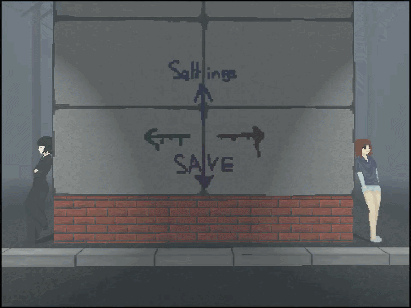
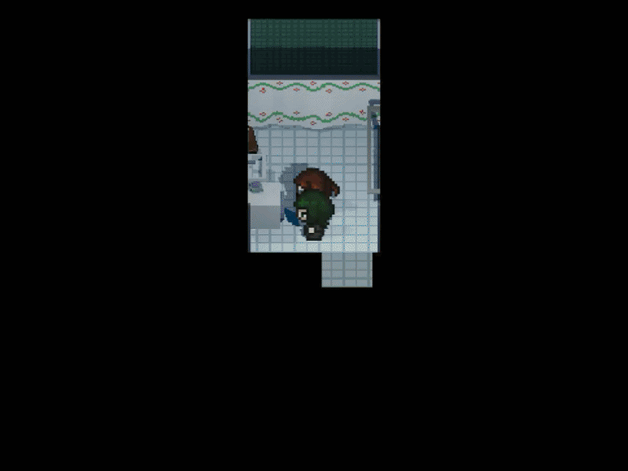
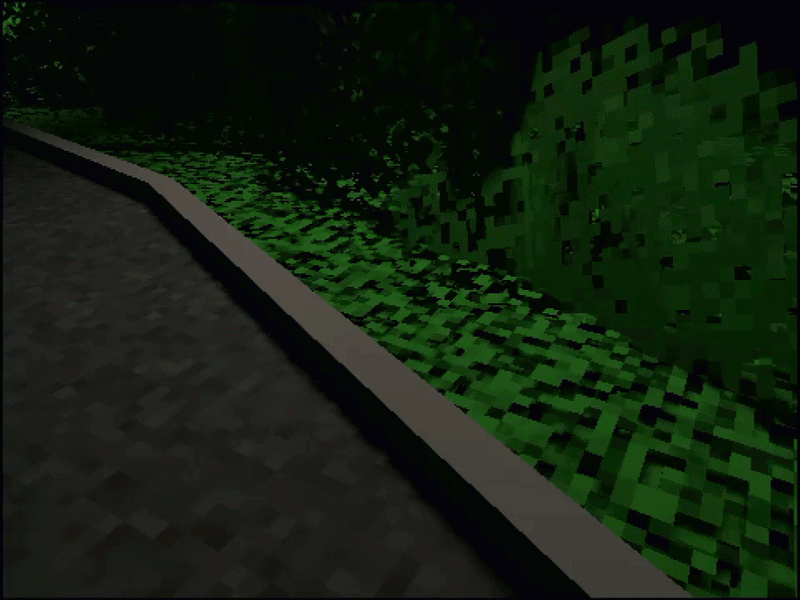

# 🎮 Dealing With Stuff

### A short story-driven JRPG focused on fast tactical combat, exploration and character progression.

---

## 📖 About the Game

**Dealing With Stuff** is a short, story-driven JRPG created as my Bachelor thesis project.

The game combines exploration, character interaction and turn-based combat into a compact experience designed to keep the gameplay fast and focused.

The combat system is built around **character speed and dynamic turn frequency**, allowing faster characters to act more often and creating a more active alternative to a traditional fixed turn-order system.

The project was developed as a **solo project**, covering programming, game systems, design and visual production.

---

## 🎮 Gameplay

The core gameplay loop is:

```text
EXPLORE
   ↓
ENCOUNTER
   ↓
BATTLE
   ↓
PROGRESS
   ↓
STORY
   ↓
EXPLORE
```

### ⚔️ Combat

Combat is turn-based, with character speed affecting how frequently characters receive turns.

The goal was to create battles that feel **quick, readable and dynamic**, while still allowing the player to make meaningful tactical decisions.

### 🗺️ Exploration

Players explore 3D environments, interact with characters and objects, discover events and progress through the story.

### 📈 Progression

Characters can develop throughout the game, giving the player new options as they progress through the story.

---

## ⚙️ Game Systems

The project includes several interconnected gameplay systems:

* ⚔️ Turn-based combat
* ⏱️ Dynamic turn order
* 🧍 Character system
* 📈 Character progression
* 🎒 Inventory
* 💬 Dialogue system
* 🗺️ Exploration and interaction
* 🖥️ Gameplay UI

---

## 🧠 Technical Focus

The project gave me experience working with gameplay systems and connecting multiple systems into a playable game.

### Programming

* Gameplay programming
* Game state management
* Turn-based combat logic
* Character and enemy behaviour
* UI interaction
* System integration
* Debugging and iteration

### Game Development

* Designing gameplay systems
* Prototyping mechanics
* Balancing gameplay
* 2D / 3D integration
* Player interaction
* Game flow and progression

**Engine:** Godot
**Language:** GDScript
**Development:** Solo Project
**Project Type:** Bachelor Thesis

---

## 🎨 Visual Style

The game combines **3D environments with 2D characters and pixel-art inspired visuals**.

The visual direction was influenced by the presentation of classic handheld JRPGs while using a modern 3D environment.

### Tools

`Godot` · `Aseprite` · `Clip Studio Paint` · `Blockbench`

---

## 👨‍💻 My Contribution

As the sole developer, I worked across the entire project:

* Gameplay programming
* Combat system
* Turn-order system
* Character systems
* Progression systems
* Inventory
* Dialogue and UI
* Game design
* Level design
* Visual assets
* Prototyping
* Debugging
* Optimization

---

## 📸 Screenshots






---

## 🎥 Gameplay

▶ **[Watch the gameplay video](https://youtu.be/NGgWrP608CA)**

---

## 🎮 Play the Game

**[Download / Play the Build](BUILD_LINK)**

---

## 📚 Project Information

|                 |                 |
| --------------- | --------------- |
| **Engine**      | Godot           |
| **Language**    | GDScript        |
| **Type**        | Turn-Based JRPG |
| **Development** | Solo            |
| **Purpose**     | Bachelor Thesis |
| **Status**      | Early Demo      |

---

<p align="center">

### Thanks for checking out the project!

</p>
